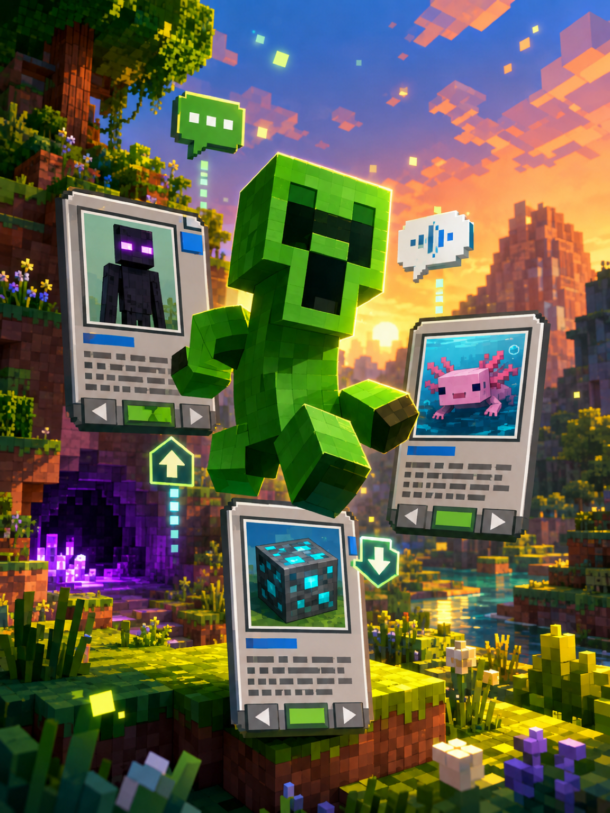
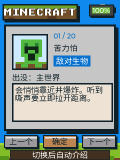

# Talking Minecraft Guide

A pocket-sized talking Minecraft guide. Use Up and Down to browse 20 mobs,
blocks, and items. Every page includes original pixel art, a location, and a
practical survival tip. A new entry is narrated automatically; press OK to hear
it again.

[简体中文](README.zh_CN.md)



## How to play

- Up: show the previous entry.
- Down: show the next entry.
- OK: replay the current narration.

The catalog includes the Creeper, Enderman, Axolotl, Ender Dragon, Warden,
Elytra, and fourteen more entries.



## Build

This project is based on the official FoloToy AI Passport firmware repository.
After preparing an ESP-IDF 5.5 environment, run:

```bash
idf.py build
idf.py merge-bin
```

Run the complete validation suite with:

```bash
./tools/validate.sh
```

## Assets and licensing

- The Chinese font subset comes from Noto Sans CJK under the SIL Open Font
  License 1.1. Its license is stored at `assets/fonts/OFL-NotoSansCJK.txt`.
- The entry copy, pixel illustrations, and Chinese narration were created for
  this project.
- Base project: [folotoy/ai-passport](https://github.com/folotoy/ai-passport).
- This is an unofficial fan-made project and is not affiliated with Mojang
  Studios or Microsoft.
