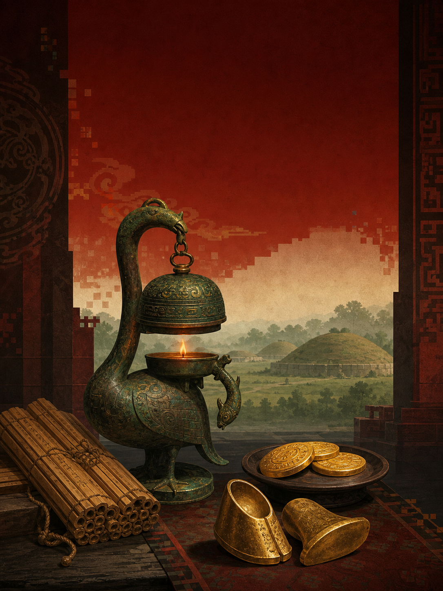
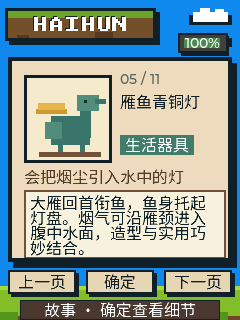

<p align="right">
  <a href="README.zh_CN.md">简体中文</a> · <strong>English</strong>
</p>

# Haihunhou Museum Pocket Tour

<p align="center">
  
</p>

An offline, eleven-stop virtual guide to the Museum for the Haihun Fief of the
Han Dynasty in Nanchang. It follows Liu He from king to emperor to marquis, then
uses gold objects, a bronze lamp, lacquer painting, bamboo manuscripts, bells,
and coins to reconstruct one extraordinary Western Han life.

Every stop has an original pixel illustration and two Chinese narrations: a
short story and a closer look. All 22 clips play offline.

## Preview

<p align="center">
  
</p>

## How to explore

- UP: previous stop.
- DOWN: next stop.
- OK: switch between the story and close-look view.

The guide narrates on startup, navigation, and view changes. New input interrupts
the current narration immediately, so browsing stays responsive.

## Tour selection

The route covers Liu He, hoof- and toe-shaped gold, gold cakes, the goose-and-fish
bronze lamp, the lacquered Confucius screen, the rediscovered *Analects*
manuscripts, chime bells, Wu Zhu coins, museum director Peng Minghan, and visit
information. It is a curated introduction, not an official ranking of objects.

## Research basis

The archaeological park combines the marquisate capital, cemetery, tombs,
museum, and protected site. Current official reporting records more than 10,000
sets of finds since excavation began in 2011. Visitor information can change;
confirm tickets, hours, and transport before traveling.

Key sources:

- [Nanchang Municipal Government — museum and archaeological park overview](https://www.nc.gov.cn/ncszf/rwfg/202208/8621e793af2543cbbb817e2ca2b7c1ca.shtml)
- [Ministry of Culture and Tourism — Museum for the Haihun Fief](https://zhuanti.mct.gov.cn/hhhbwg2022.html)
- [Haihun Site Administration — representative bronzes and daily life](https://www.hhh.gov.cn/article/6636.html)
- [China Daily government services — address, hours, and booking](https://govt.chinadaily.com.cn/s/202501/15/WS67875d37498eec7e1f72d4a1/nanchang-museum-for-haihun-fief-of-han-dynasty.html)
- [China Publishing & Media Journal — director Peng Minghan](https://www.cbbr.com.cn/contents/533/102937.html)

## Build

The ready-to-flash merged image is at
`build/FoloToy-AI-Passport-haihunhou-full.bin`.

```bash
source /path/to/esp-idf-v5.5.3/export.sh
./tools/validate.sh
```

## Assets and licensing

- `assets/fonts/haihunhou_zh_16.c` is a Noto Sans CJK SC glyph subset under the
  SIL Open Font License 1.1.
- Exhibit images are original code-drawn pixel art; no museum photography,
  official logo, or third-party artwork is embedded.
- `assets/music/haihunhou_tts/` contains 22 project-authored Chinese narration
  WAV files. The generator packs them as IMA-ADPCM for chunked offline playback.
- Base firmware: [folotoy/ai-passport](https://github.com/folotoy/ai-passport).
