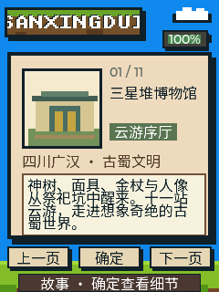

<p align="right">
  <strong>简体中文</strong> · <a href="README.md">English</a>
</p>

# 三星堆博物馆口袋云游

<p align="center">
  
</p>

这是一款可离线使用的十一站三星堆云导游。大立人、神树、面具、黄金、玉器和新祭祀
坑组合器物，组成一条从考古发现走向未解之谜的古蜀路线。

每一站都有原创像素插图，并配“故事”和“细看”两段中文讲解，共 22 段离线语音。

## 画面预览

<p align="center">
  
</p>

## 怎么玩

- 上键：上一站。
- 下键：下一站。
- 确定键：切换当前页的“故事”和“细看”。

启动、翻页和切换视图都会自动朗读。新的操作会立即打断上一段讲解，不会让长语音
阻塞浏览。

## 十一站路线

路线包括青铜大立人、一号青铜神树、青铜纵目面具、金杖、金面具、青铜顶尊跪坐
人像、龟背形网格状器、祭山图玉璋、馆长雷雨和到馆信息。仍有争议的解释会明确保留
为问题，不把想象写成考古定论。

## 调研依据

三星堆博物馆新馆于 2023 年开放，以“世纪逐梦、巍然王都、天地人神”三部分展开，
展出一千五百余件套文物。节假日和暑期安排可能变化，请通过官方渠道预约，并在出发
前查看最新公告。

主要来源：

- [三星堆博物馆官网](https://www.sxd.cn/index.asp)
- [文化和旅游部：三星堆博物馆新馆与展陈概览](https://www.mct.gov.cn/wlbphone/wlbydd/xxfb/qglb/sc/202308/t20230801_946332.html)
- [中央纪委国家监委网站：代表性馆藏细节](https://m.ccdi.gov.cn/content/d0/4d/3539.html)
- [广汉市政府：开放时间与官方预约渠道](https://www.guanghan.gov.cn/gk/zjah/ahll/1647848.htm)
- [河北省文旅厅转载新华社：馆长雷雨](https://whly.hebei.gov.cn/c/2025-06-24/581327.html)
- [中国政府采购网：当前馆址](https://www.ccgp.gov.cn/cggg/dfgg/zbgg/202505/t20250530_24688328.htm)

## 构建

可直接烧录的合并镜像位于
`build/FoloToy-AI-Passport-sanxingdui-full.bin`。

```bash
source /path/to/esp-idf-v5.5.3/export.sh
./tools/validate.sh
```

## 素材与许可

- `assets/fonts/sanxingdui_zh_16.c` 为 Noto Sans CJK SC 中文子集，采用 SIL
  Open Font License 1.1。
- 展品图均为固件内原创像素画，不含博物馆照片、官方标识或第三方作品。
- `assets/music/sanxingdui_tts/` 保存 22 段由项目自编文案生成的中文讲解 WAV，
  构建时打包为 IMA-ADPCM，在设备上分块离线播放。
- 基础固件来源：[folotoy/ai-passport](https://github.com/folotoy/ai-passport)。
