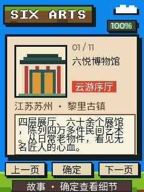

<p align="right">
  <strong>简体中文</strong> · <a href="README.md">English</a>
</p>

# 六悦博物馆口袋云游

<p align="center">
  
</p>

这是为 FoloToy AI Passport 制作的一款离线博物馆云游应用。十一个紧凑页面依次
介绍六悦博物馆、七件代表性民间艺术藏品、创办人杜维明、馆长陈杰和实用到馆
信息。

界面采用代码原创绘制的像素插图，无需联网，并针对设备的 240 × 320 屏幕设计。
每一页的“故事”和“细看”都有独立的离线中文讲解，共 22 段语音。

## 画面预览

<p align="center">
  
</p>

<p align="center"><em>从云游序厅出发，开启十一站语音导览路线。</em></p>

## 操作方式

- 上键：上一页。
- 下键：下一页。
- 确定键：在当前页的“故事”和“细看”文案之间切换。

应用启动、翻页或切换“故事/细看”时会自动朗读当前内容。新的操作会立即中断上一段
讲解并播放当前页面，不会阻塞按键。底部状态栏会显示“云导游讲解中…”。

云游选取狮子雀替、多进拔步床、门神彩绘门、明清花窗、神轿、1877 年的
“达尊有二”匾额和万佛石窟。它们不是馆方发布的价值排名，而是一条策展式路线：
用七件器物串起建筑、居家、礼俗、信仰和社区记忆。

## 调研依据

博物馆官网介绍，馆内四层、六十余个展馆陈列四万多件藏品，收藏重点包括古建
构件、木石雕刻、庙宇及居家民间艺术和古家具。官网目前列出的开放时间为每日
9:00—18:00。

主要来源：

- [六悦博物馆官网：博物馆与展馆概览](https://www.6arts.org/museum)
- [六悦博物馆官网：三方历史匾额研究](https://www.6arts.org/blog/explanation-of-three-plaques-in-six-arts-museum)
- [六悦博物馆官网转载：收藏历程与代表性拔步床](https://www.6arts.org/blog/2cb8514003e)
- [中新社：杜维明的中国收藏故事](https://www.br-cn.com/static/content/news/ch_news/2024-10-30/1301148165479095610.html)
- [新华日报：馆长陈杰与藏品保护方式](https://www.sohu.com/a/897870976_121455647)
- [苏州市文化广电和旅游局：备案地址](https://wglj.suzhou.gov.cn/szwhgdhlyj/bwg/list_tt.shtml)

开放时间、票务和交通可能调整，出发前请以馆方最新通知为准。

## 构建与验证

项目面向 ESP32-C3 和 ESP-IDF 5.5.3，保留 AI Passport 的 8 MB Flash、3 MB
应用上限、`cardid`、永久 Recovery 和上键五秒进入 Recovery 等兼容约定。

```bash
source /path/to/esp-idf-v5.5.3/export.sh
./tools/validate.sh
```

## 素材与许可

- `assets/fonts/six_arts_zh_16.c` 是从 Noto Sans CJK SC Regular 生成的中文子集，
  采用 SIL Open Font License 1.1；许可文件位于
  `assets/fonts/OFL-NotoSansCJK.txt`。
- 所有展品插图均为固件内原创 RGB565 像素绘制，没有复制或嵌入博物馆照片。
- `assets/music/six_arts_tts/` 保存 22 段由项目自编文案生成的中文 TTS 源 WAV；
  `tools/generate_six_arts_tts.py` 使用 macOS 婷婷系统音色生成 16 kHz、16 位、
  单声道音频，再打包成 `main/six_arts_tts_audio.c` 中的 IMA-ADPCM 数据。设备在
  独立任务中分块解码播放，不包含第三方录音，也不需要云端密钥。
- 基础固件来源：[folotoy/ai-passport](https://github.com/folotoy/ai-passport)。
