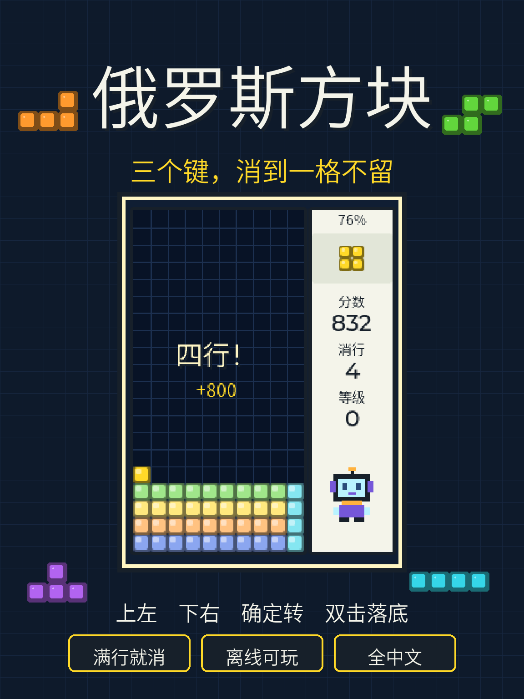
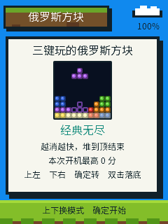

  <strong>简体中文</strong> · <a href="PREPARATION.md">English</a>

# 俄罗斯方块发布准备

材料已就绪，固件已安装到设备并确认能正常启动，**尚未提交社区审核**。

从 `0x0` 写入 760768 字节，写入范围结束于 `0xB9BC0`，在受保护的 `cardid`（`0x356000`）和 Recovery（`0x700000`）之前，两者未被触及，也没有执行 erase-flash。写入后校验通过，启动日志显示按键与电量计均就绪。上图为通过 USB 读回的真机帧缓冲；对局画面与消除动画的真机截图仍待补。

## 待确认的公开字段

**中文标题：** 俄罗斯方块｜三个键玩的方块游戏

**中文简介：**

把 AI Passport 变成一台随身方块机。三个键就够：上键左移，下键右移，确定键单击旋转、双击直接落底。

方块下面一直有一圈虚影，标出松手会落在哪里；落到底之后还有半秒时间再挪一格。每消掉一行，整行先闪白、再炸开，上面的方块跟着塌下来；四行齐消时井会抖两下，横幅告诉你这一下拿了多少分。

两种玩法：经典无尽越消越快，堆到顶结束，比总分；冲刺二十行比谁更快，适合和朋友抢秒数。连续消行有连击加分，把棋盘清空还有全清奖励。

结果页会给出题号，同一个题号方块顺序完全一样，发给朋友就能同题比分。全中文操作、离线可用，无需账号，不联网、不用语音。玩累了记得让眼睛歇一会儿。

英文标题与简介见 [English](PREPARATION.md)；全部字段的唯一结构化草稿是
[publication.json](publication.json)，其中 `confirmed` 和 `upload` 均为 `false`。

**公开仓库：** [esp32demo](https://github.com/liutaocode/esp32demo)。本应用独立入口为
[README.zh_CN.md](README.zh_CN.md)。本地新增目录尚未推送。

## 文件清单与校验

| 项目 | 文件 | 字节数 | SHA-256 |
| --- | --- | --- | --- |
| 完整固件 | `../../build/clean-sweep/FoloToy-AI-Passport-full.bin` | 760768 | `1827741062b74fdadb7f6704493cffe4966c16de8ad3d3b6bec3a92cefba7389` |
| 社区封面 | `../../assets/images/clean_sweep/community-cover.png` | 88324 | `82c415bb5ba421e3f211d40bfef35c43602dc27d78480e9c2b392230209f1989` |
| 真机首页截图 | `../../assets/images/clean_sweep/runtime-home.png` | 5397 | `05b59eff6eb8c11d521fd7f3a3daf37b87bacc05517aebfb6c1345acd69bd65c` |

- 封面：1152 × 1536，竖版 3:4，由 [tools/render_clean_sweep_cover.py](../../tools/render_clean_sweep_cover.py)
  合成，中间是真实的 LVGL 主机渲染，没有渲染之外的承诺。
- 界面截图：[assets/images/clean_sweep](../../assets/images/clean_sweep)，全部由
  `tools/test_clean_sweep_ui.py` 跑真实应用代码生成。
- 应用体积 695232 字节，小程序 BLE 安装契约（3 MB 上限、`cardid`、Recovery 分区、
  五秒上键入口）：PASS。
- 分区表、保护区域与合并镜像逐段校验：PASS。

## 后续顺序

1. 补一张真机对局画面（需要有人在设备上按键，串口截图无法自行触发）。
2. 开发者确认中英文标题与简介。
3. 检查官网授权状态，预览全部字段，得到明确同意后再提交。

Build: PASS（`FAP_APP=clean_sweep ./tools/validate.sh --firmware`）
Host tests: PASS（状态机回归与 LVGL 主机 UI 逐帧检查）
Device tests: PARTIAL（烧录校验、启动日志、首页帧缓冲；未做按键操作验收）
Unverified: 实机按键延迟与手感、消除动画流畅度、屏幕实际颜色、长时间运行、社区审核。

## 提交结果

提交成功，官方状态为 **pending（等待审核）**。项目编号 201，版本编号 298，项目标识 `community-4e55d1d4`。

上传前的核对：官方助手的固件、封面、串口截图三项校验全部通过（三段镜像、1152 × 1536 严格 3:4、带回执的新鲜帧缓冲）；已列出账号下 36 个既有项目，确认没有同名条目，因此按新建提交而不是改版。发布助手 ZIP 的 SHA-256 为 `d5a246365f498b9518d0c94c6e308c7e5df155f8d05893d654da8ee2ff5529a9`，与本仓库上一次提交记录下来的官方 ZIP 一致。授权沿用此前仍然有效的创作者令牌，助手不接触密码。
