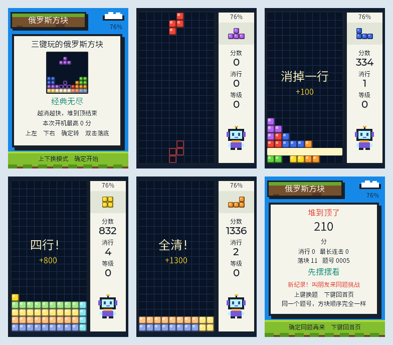

  <a href="README.zh_CN.md">简体中文</a> · <strong>English</strong>

# Clean Sweep

Tetromino stacking on three keys. Up moves left, down moves right, a single click on OK rotates, and a double click drops the piece to the floor. Every cleared line flashes white, bursts apart, and lets the rows above collapse into place; a four-line clear also shakes the well.

The image is an LVGL host render of the real application code with simulated buttons and battery, not a device photo.

## Device screen

Read over USB from the framebuffer of a device running this firmware. Flashing, boot and the home page are confirmed; a full round, the clear animation and sustained operation still need hardware testing.

## How to play

- **Endless classic**: the level rises every ten cleared lines, pieces fall faster, the game ends when the stack reaches the top, and players compare score.
- **Twenty-line sprint**: clear twenty lines to win and compare elapsed time with friends.
- The well is ten columns by twenty rows and fills the screen. The right column carries only the battery, next piece, score, cleared lines, and level (elapsed time in sprint mode); once a round starts no instructional text remains on screen, and the key map lives on the home and pause pages.
- A ghost outline always marks where the piece will land, so the drop needs no guessing.
- After a piece touches down there is half a second of grace to slide or rotate it once more.
- Scoring: 100, 300, 500, and 800 for one to four lines, multiplied by level plus one. Consecutive clears add a combo bonus, emptying the board adds a perfect-clear bonus, and a held drop adds two points per row.
- The result page shows a puzzle number. The same number always produces the same piece order, so sharing it sets up a fair rematch. Records live in memory only and reset on power cycle.

## Keys

| Page | Up | Down | OK click | OK double click | OK hold |
| --- | --- | --- | --- | --- | --- |
| Home | Switch mode | Switch mode | Start | Start | None |
| Playing | Move left | Move right | Rotate | Drop to the floor | Pause |
| Paused | Resume | Back to home | Resume | Resume | Back to home |
| Result | New puzzle | Back to home | Same puzzle again | Same puzzle again | None |

The three OK actions sit on click, double click, and hold, which never overlap: the button driver reports exactly one of them per physical press, a hold never emits a trailing click, and a double click never emits a single click first. So holding OK cannot rotate the piece by accident, and a double click lands it exactly where the ghost showed. Left and right act on the press edge with no added delay; a rotation waits about 0.2 s after release to rule out a double click, and a hold takes about 1.5 s.

One minute idle pauses the game and dims the screen, three minutes turns it off; the first key after dimming only wakes the device, and up resumes from the pause page. The interface is Simplified Chinese and fully offline, with no account or network dependency. This version ships without TTS: clearing feedback comes from the animation, banner, and score.

## Source and validation

- [Application source and build notes](../../main/apps/clean_sweep/README.md)
- Build: with ESP-IDF 5.5.3 activated, run `FAP_APP=clean_sweep ./tools/validate.sh` from the repository root.
- Output: `build/FoloToy-AI-Passport-full.bin`.
- The interface uses a dedicated Chinese subset font, and host tests check glyph availability, text widths, and screen bounds on every frame while playing a full game.
- Hardware still needs to confirm press latency, animation smoothness, screen colors, and sustained operation. The existing BLE Recovery partition and the five-second UP-key recovery entry are unchanged.

## Review material

The cover is composed by a script in this repository around the real host render, so it promises nothing the firmware does not do. The submission checklist is in [PREPARATION.md](PREPARATION.md).
